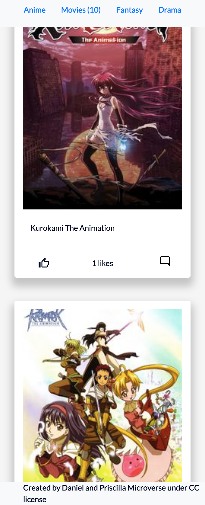

# Group-Capstone

> This is an API based webapp that displays movies and their titles. This is a single-page application(SPA) which contains the home page and comments modal pop-ups. Users can click the `thumbs up` icon to give a like to their favorite and post comments by clicking on the `comment` button in the modal.  

# Demo Link

Click [here](https://mmatongo.github.io/group-capstone/dist//) to view the website online.
# Screenshot

Width - 1440px

Width - 470px

# Getting Started

To get a local copy up and running follow these simple steps.

- You can clone this repo by typing `git clone git@github.com:mmatongo/group-capstone.git` on your terminal.

- Type `cd group-capstone` to access the project on the terminal.
  
- Run `npm install` from your editor's terminal.

- Run `npm run build` from your editor's terminal.

- Run `npm run start` from your editor's terminal to view the project in your browser.

- Run `npx hint` . to check for HTML Linter errors.

- Run `npx stylelint "**/*.{css,scss}"` to check for CSS Linter errors.

# This project was built with:

HTML5

CSS3

JavaScript

Webpack

Jest Library
# Version Control System

GIT

# 👤 Authors

👤 **Daniel M. Matongo**

- GitHub: [Daniel M. Matongo](https://github.com/mmatongo)
- LinkedIn: [Daniel M. Matongo](https://linkedin.com/in/mmatongo)

👤 **Oni Olajumuke Priscilla**

- GitHub: [Oni Olajumuke Priscilla](https://github.com/prolajumokeoni)
- LinkedIn: [Adedamola Shittu](https://www.linkedin.com/in/olajumoke-priscilla-oni-44a48b162/)

# 🤝 Contributing

Contributions, issues, and feature requests are welcome!

Feel free to check the [issues page](../issues).

# Show your support

Give a ⭐️ if you like this project!

# Acknowledgement
- Hat tip to anyone whose code was a source of inspiration.
- A big thanks to [TVMAZE](https://www.tvmaze.com/) for making the API endpoints readily available for use.
- A big thanks to [@microverseinc](https://github.com/microverseinc) for providing the involvement API.

# 📝 License

This project is [MIT](./MIT.md) licensed.
